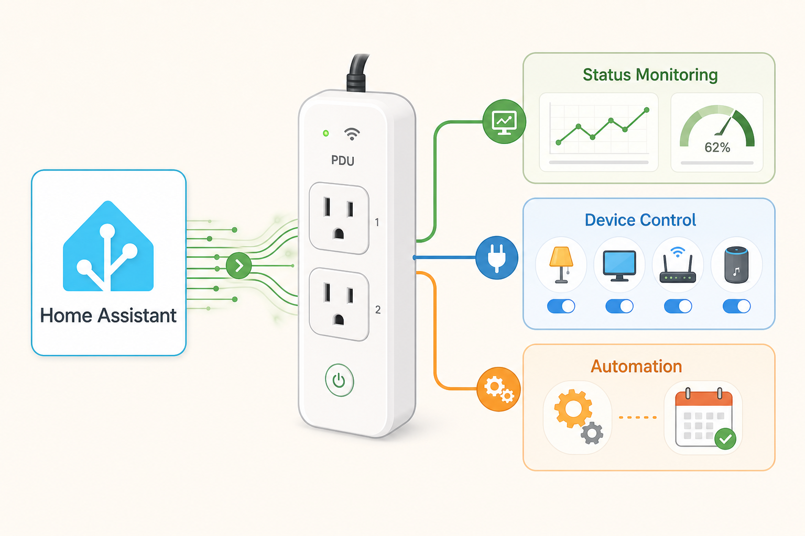

# MSNSwitch Integration for Home Assistant (HACS)

<p align="center">
  
</p>

<p align="center">
  
</p>

[](https://github.com/hacs/integration)
[](https://github.com/zlatko-lakisic/hacs-msnswitch/actions/workflows/validate.yml)
[](LICENSE)

A custom Home Assistant integration to monitor, control, and automate **Proxicast MSNSwitch** / **MSNSwitch2** smart power switches (UIS-622, UIS-722).

The integration talks directly to each unit's **local HTTP API** on your LAN — no cloud required. Toggle outlets, read UIS auto-reset state, monitor ping checkers, and reboot stuck gear from Home Assistant automations.

## Features

- **Local control** — LAN-only HTTP API; no cloud dependency
- **One config entry per device** — add each MSNSwitch by IP, username, and password
- **Named outlets** from the device (e.g. Router, Modem, Traefik, NAS1)
- **UIS auto-reset** switch — enable or disable automatic power cycling
- **Reset buttons** — per outlet and all outlets
- **Checker health** — connectivity binary sensors plus response time, packet loss, and timeout sensors
- **Automation ready** — standard HA entities for schedules, alerts, and network watchdog logic
- **UIS-622 support** — automatically repairs malformed JSON from older firmware

## Prerequisites

Before installing, ensure that:

1. Your MSNSwitch is on the **same LAN** as Home Assistant (or routable from it).
2. The device has a **stable IP** (static or DHCP reservation).
3. Your **Home Assistant host IP** is on each unit's **System → API Whitelist** (required for API access).
4. You know the **web UI username and password** for each switch.

## Installation

See **[docs/INSTALL.md](docs/INSTALL.md)** for full details.

### Via HACS (recommended)

1. Open **HACS → Integrations**.
2. **⋮ → Custom repositories**
3. Add `https://github.com/zlatko-lakisic/hacs-msnswitch` as category **Integration**.
4. Search **MSNSwitch**, download, and **restart Home Assistant**.

### Manual install

```powershell
powershell -ExecutionPolicy Bypass -File scripts/install-to-ha.ps1 -ConfigRoot '\\your-ha-host\config'
```

Or copy `custom_components/msnswitch` into your HA `config/custom_components/` folder, then restart.

## Configuration

This integration uses **config flow** — no YAML required.

1. **Settings → Devices & services → Add integration**
2. Search **MSNSwitch**
3. Enter **Host** (IP), **Username**, and **Password**
4. Repeat for each physical MSNSwitch (one entry per device)

## Entities

Per device, Home Assistant creates entities based on the live API response:

| Type | Examples |
|------|----------|
| Switch | Outlet names from the device, UIS auto-reset |
| Button | Reset per outlet, reset all outlets |
| Binary sensor | Checker target healthy / unhealthy |
| Sensor | Response time, packet loss, timeouts |

## API

- `POST /api/status` — outlet state and connection checkers
- `POST /api/control?target=…&action=…` — outlets (`outlet1`, `outlet2`, `outlet_all`) or UIS (`uis` / legacy `us`)

**UIS-622 note:** some firmware returns malformed JSON (missing commas between array objects and sometimes a missing final `}`). The integration repairs this automatically.

Test from a whitelisted machine:

```bash
curl --http1.1 -s --url 'http://<msnswitch-ip>/api/status' \
  --data 'user=YOUR_USER&password=YOUR_PASSWORD'
```

## Releasing new versions

See **[docs/RELEASE.md](docs/RELEASE.md)**.

## Repository layout

```
hacs-msnswitch/
├── custom_components/msnswitch/   # Integration source
├── images/                        # README branding + hero image
├── docs/                          # Install and release guides
├── scripts/install-to-ha.ps1      # Copy to HA config share
├── hacs.json
└── README.md
```

## License

MIT — see [LICENSE](LICENSE).
